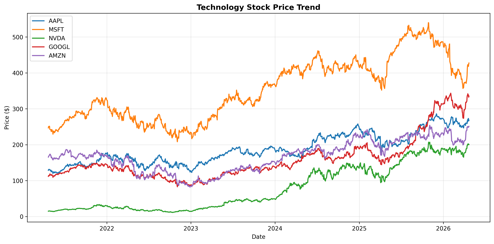
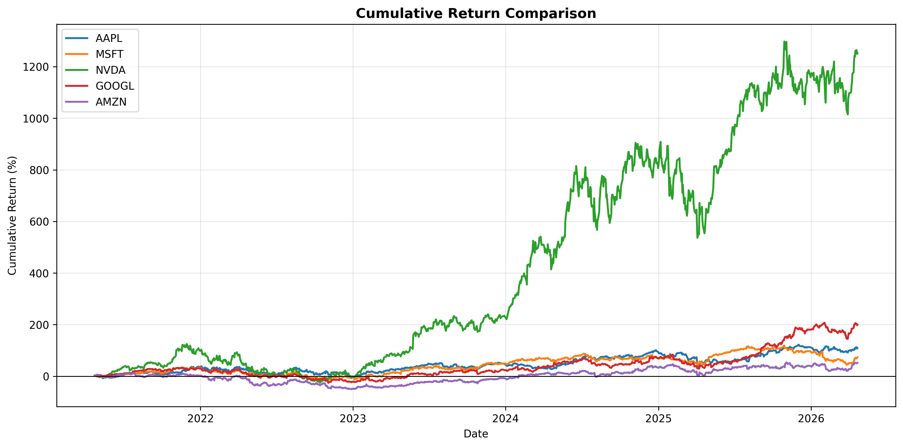
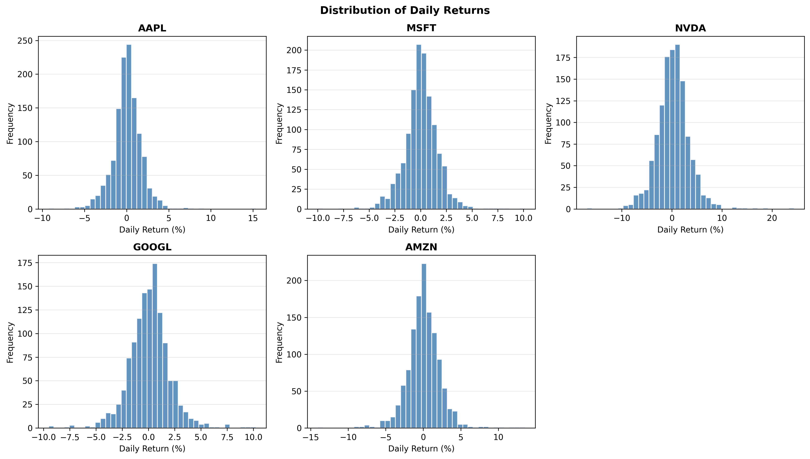
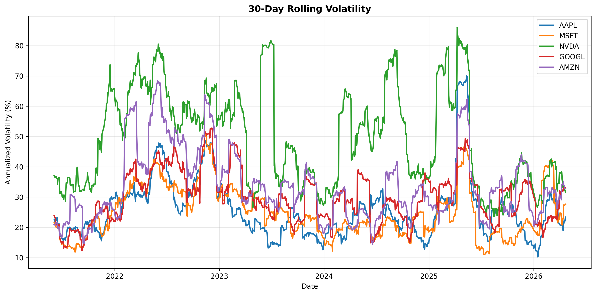
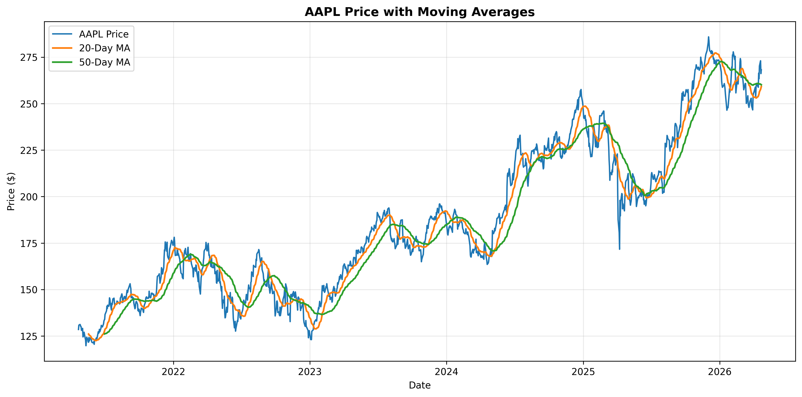
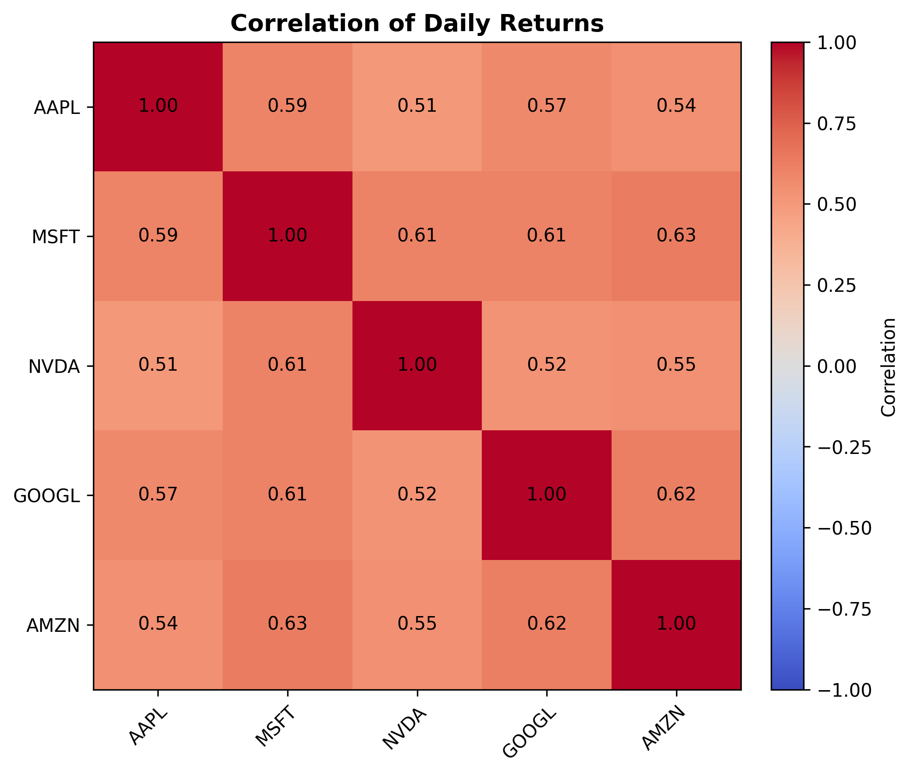

# Python-Based Stock Market Analysis of Major Technology Companies

This repository contains an ACC102 Track 2 mini assignment project that uses Python to analyse the stock market behaviour of five major technology companies:

- Apple (`AAPL`)
- Microsoft (`MSFT`)
- NVIDIA (`NVDA`)
- Alphabet (`GOOGL`)
- Amazon (`AMZN`)

The project uses five years of daily historical stock price data from Yahoo Finance and applies a simple, reproducible workflow covering data download, cleaning, transformation, analysis, visualisation, and interpretation.

## Project Purpose

The analytical question behind this project is:

**What can five years of daily stock price data tell beginner investors and business students about stock trends, return patterns, volatility, correlation, and downside risk among major technology companies?**

This is a descriptive data analysis project rather than a prediction project. The aim is to compare the five companies clearly and explain the results in an accessible way.

## Target Audience

This project is intended for:

- beginner retail investors who want a simple introduction to stock analysis
- business students learning how Python can be used for financial data analysis
- instructors or classmates reviewing a reproducible undergraduate assignment

## Companies and Data Analysed

### Companies

The analysis focuses on the following five US technology companies:

- `AAPL` - Apple
- `MSFT` - Microsoft
- `NVDA` - NVIDIA
- `GOOGL` - Alphabet
- `AMZN` - Amazon

### Data Used

- **Source:** Yahoo Finance via the `yfinance` Python library
- **Frequency:** Daily historical market data
- **Period analysed:** Last 5 years
- **Main price series:** Adjusted close where available, otherwise close

### Metrics Calculated

The project computes and compares:

- daily returns
- cumulative returns
- rolling 30-day volatility
- 20-day and 50-day moving averages
- correlation matrix of daily returns
- maximum drawdown
- summary statistics table

## Environment

This project was developed and tested in a local virtual environment with the following setup:

- **Operating system:** macOS
- **Python version:** Python 3.9
- **Environment style:** local `venv`

### Python packages

Main libraries used in this project:

- `pandas`
- `numpy`
- `matplotlib`
- `yfinance`
- `jupyter`
- `urllib3<2`

All required packages are listed in [requirements.txt](requirements.txt).

## Repository Structure

```text
python-stock-analysis-tech-companies/
├── data/
│   └── raw/
│       └── technology_stock_prices.csv
├── outputs/
│   ├── figures/
│   │   ├── 01_price_trend.png
│   │   ├── 02_cumulative_returns.png
│   │   ├── 03_daily_return_distributions.png
│   │   ├── 04_rolling_volatility.png
│   │   ├── 05_aapl_moving_averages.png
│   │   └── 06_correlation_heatmap.png
│   └── tables/
│       ├── correlation_matrix.csv
│       ├── maximum_drawdown.csv
│       └── summary_statistics.csv
├── analysis.py
├── notebook.ipynb
├── README.md
├── requirements.txt
├── reflection_draft.md
├── demo_script.md
└── .gitignore
```

## Analytical Workflow

The project follows these steps:

1. Download daily stock price data for the five selected companies.
2. Extract the adjusted closing price series from the `yfinance` output.
3. Clean the dataset and handle missing values conservatively.
4. Calculate daily returns and cumulative returns.
5. Measure rolling 30-day volatility.
6. Compute short-term and medium-term moving averages.
7. Analyse return correlation across the five stocks.
8. Measure maximum drawdown for each stock.
9. Save figures and tables for reporting and GitHub presentation.

## Main Findings

The exact results depend on the download date, but the current run of the project produced the following broad findings:

- `NVDA` delivered the strongest total return over the five-year period, but it also showed the highest volatility and the deepest maximum drawdown.
- `GOOGL` and `AAPL` also produced strong long-run growth compared with `MSFT` and `AMZN`.
- The stocks are all large technology companies, so their return correlations are generally positive, which means a tech-only portfolio still has concentration risk.
- Strong returns do not come without risk. The drawdown and volatility measures show that higher-growth stocks can also experience much larger declines.

These findings should be treated as educational observations based on historical data, not as investment advice.

## Current Summary Statistics

The current output table generated by the script is saved in [outputs/tables/summary_statistics.csv](outputs/tables/summary_statistics.csv).

Key headline results from the latest run:

- `NVDA` total return: `1252.33%`
- `GOOGL` total return: `200.08%`
- `AAPL` total return: `108.73%`
- `MSFT` total return: `73.22%`
- `AMZN` total return: `51.74%`
- Highest annualized volatility: `NVDA` at `51.55%`
- Deepest maximum drawdown: `NVDA` at `-66.34%`

## Output Figures

The repository includes the generated figures directly in the `outputs/figures/` folder.

### 1. Stock Price Trend



This figure compares the absolute price trend of all five companies across the five-year period.

### 2. Cumulative Returns



This figure is more useful for comparing investment performance because it shows growth relative to the starting point.

### 3. Daily Return Distributions



This figure shows how daily returns are distributed for each stock and gives a simple visual sense of day-to-day risk.

### 4. Rolling 30-Day Volatility



This figure shows how return volatility changes over time instead of assuming that risk stays constant.

### 5. Moving Averages for AAPL



This figure uses 20-day and 50-day moving averages to show short-term and medium-term trend behaviour for Apple.

### 6. Correlation Heatmap



This figure shows how closely the daily returns of the five technology stocks move together.

## How to Run the Project

### 1. Create or activate a virtual environment

Example:

```bash
python -m venv venv
source venv/bin/activate
```

### 2. Install dependencies

```bash
pip install -r requirements.txt
```

### 3. Run the analysis script

```bash
python analysis.py
```

This will:

- download the latest five years of stock data
- generate summary tables
- save figures into `outputs/figures/`
- save tables into `outputs/tables/`

### 4. Run the notebook

```bash
jupyter notebook notebook.ipynb
```

Run the notebook from top to bottom for a more presentation-friendly version of the same workflow.

## Files to Review

- [analysis.py](analysis.py): main Python workflow
- [notebook.ipynb](notebook.ipynb): presentation-friendly notebook
- [outputs/tables/summary_statistics.csv](outputs/tables/summary_statistics.csv): main summary table
- [reflection_draft.md](reflection_draft.md): editable reflection draft
- [demo_script.md](demo_script.md): short speaking script for demo video

## Limitations

- The analysis is based on historical price data only and does not predict future performance.
- Only five large technology companies are included, so the analysis does not represent the whole stock market.
- The project does not include company fundamentals such as earnings, valuation, or balance-sheet information.
- Correlation and volatility can change over time, especially during unusual market conditions.
- Yahoo Finance is practical for learning and small projects, but it is still a public secondary data source.

## Assignment Context

This repository was created for **ACC102 Track 2: GitHub Data Analysis Project**. The goal was to build a complete but manageable undergraduate project that demonstrates a coherent Python data analysis workflow using real financial data.
